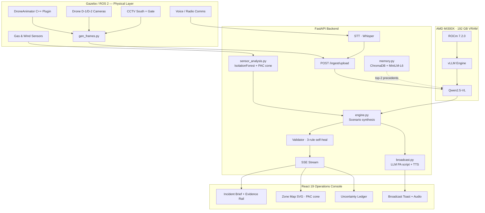

<div align="center">
  
  
  
  
  
  
  <br />
  <br />

  <h1>VesperGrid</h1>
  <p><strong>Critical infrastructure operational twin powered by AMD MI300X.</strong></p>

  <p>
    VesperGrid turns fragmented industrial evidence into a source-linked decision-support model that explains what is happening, what may happen next, and which candidate plan is safest under uncertainty.
  </p>
  
  <p>
    <i>Built for the Vision & Multimodal AI Hackathon. Special thanks to AMD for providing the incredible MI300X cloud infrastructure that made this vision a reality.</i>
  </p>
</div>

---

## ⚡ The Vision

Industrial operators face a chaotic influx of signals during high-pressure incidents: drone frames, fixed-camera footage, sensor readings, radio notes, and partial field reports. The hard part is not getting a chatbot summary—the hard part is tracing **which evidence supports which decision**, understanding where the uncertainty lives, and acting confidently under time pressure.

**VesperGrid** is an **evidence-to-simulation console** built for that exact moment. It processes multimodal data streams in real-time, leveraging the massive compute of the AMD MI300X to power Qwen-VL, synthesizing a unified, actionable operational twin.

Our demo scenario, **Sector 4 Solvent Containment**, is a fully synthetic, fictional industrial safety incident in a port logistics corridor.

## ✨ Key Features

- **Source-Linked Operational Twin:** Every recommended action links to the exact evidence that shaped it — CCTV frame, gas sensor spike, or transcribed radio call.
- **Multimodal Ingest:** Processes live drone/CCTV video, voice transcripts (Whisper STT), and telemetry (gas/wind traces) simultaneously via a single multipart upload.
- **RAG Incident Memory:** ChromaDB vector store seeded with historical LNG incidents; retrieves top-2 similar precedents via `all-MiniLM-L6-v2` and injects them into the Qwen-VL prompt for context-aware reasoning.
- **IsolationForest Anomaly Detection:** `sensor_analysis.py` runs unsupervised anomaly detection on the gas/wind time-series and surfaces flagged readings in the Uncertainty Ledger.
- **PAC Evacuation Zone:** Computes a downwind exclusion cone polygon (Protected Action Criteria geometry) from gas source, wind vector, and peak ppm — rendered live on the Zone Map SVG.
- **Uncertainty Ledger:** Surfaces contradictions between sensors and models (e.g., CCTV clear but voice reports smoke) so operators never act blindly on AI output.
- **Real-Time SSE Pipeline:** Server-Sent Events keep the React console updated through the full ingest lifecycle (`queued` → `sampling` → `transcribing` → `analyzing` → `synthesizing` → `complete`).
- **Emergency Broadcast Loop:** On operator approval, generates a contextual PA script via LLM, converts it to speech with `espeak`/`pyttsx3`, and plays the audio with a live broadcast toast in the console.
- **Live Evidence Thumbnails:** Evidence Rail shows 8+ items per ingest including expandable live camera frame thumbnails pulled directly from `/api/feeds/latest/{source}`.
- **Self-Healing Validator:** 3-rule post-synthesis validator automatically corrects missing fields, type mismatches, and out-of-range confidence scores before the scenario reaches the frontend.

---

## 🛠 Tech Stack

VesperGrid is built on a modern, high-performance stack optimized for the AMD hardware ecosystem:

### Infrastructure & Hardware
- **Compute Target:** 1x **AMD Instinct MI300X** (192 GB VRAM) — *A massive thank you to AMD for the compute!*
- **Software Stack:** **ROCm 7.2.0** for seamless PyTorch and vLLM acceleration.

### Artificial Intelligence
- **Model:** **Qwen2.5-VL** (Vision-Language Model) for high-accuracy industrial frame analysis.
- **Inference Engine:** **vLLM** configured for high-throughput multimodal serving.
- **RAG Memory:** **ChromaDB** vector store + **`sentence-transformers/all-MiniLM-L6-v2`** for historical incident retrieval.
- **Anomaly Detection:** **scikit-learn IsolationForest** for unsupervised gas/wind sensor anomaly detection.
- **Frameworks:** **PyTorch** & **Hugging Face Transformers**.

### Backend API
- **Framework:** **FastAPI** (Python) for asynchronous, high-speed HTTP and SSE streaming.
- **Validation:** **Pydantic** for rigid schema enforcement of the operational twin.

### Frontend Dashboard
- **Library:** **React 19** with **TypeScript**, bundled via **Vite**.
- **Styling:** Custom Vanilla CSS tailored for a premium, tactical, dark-mode command center aesthetic.
- **Icons:** **Lucide React**.

### Simulation & Robotics
- **Simulation Environment:** **Gazebo** (Ignition Fortress) for synthesizing the physical world (gas plumes, drone cameras, physics).
- **Robotics Middleware:** **ROS 2 Humble** for message passing, sensor bridging, and node orchestration.
- **Plugins:** Custom C++ Gazebo plugin (`DroneAnimator`) for zero-overhead, 1 kHz in-loop drone motion control.
- **Frame Generator:** `gen_frames.py` — standalone synthetic camera + sensor trace generator (runs without ROS 2).

### Deployment
- **Reverse Proxy:** **Caddy** (TLS termination, HTTP/2).
- **Process Management:** **systemd** services for API, frame generator, and vLLM — all with auto-restart.
- **Serving:** **Uvicorn** (ASGI) behind Caddy.

---

## 🏗 Architecture Overview

VesperGrid's architecture is designed to capture live physical data, funnel it through advanced AI, and output an interactive decision matrix.



### Directory Structure

```text
AMD-S-2/
├── apps/
│   ├── api/                 # FastAPI backend — ingest, VLM, SSE, broadcast
│   │   └── src/vespergrid/
│   │       ├── engine.py        # Scenario synthesis (VLM + deterministic)
│   │       ├── vlm_client.py    # Qwen2.5-VL client with RAG context injection
│   │       ├── memory.py        # RAG incident memory (ChromaDB + MiniLM-L6)
│   │       ├── sensor_analysis.py # IsolationForest anomaly + PAC cone
│   │       ├── broadcast.py     # LLM PA script gen + TTS (espeak/pyttsx3)
│   │       └── ingest.py        # Async job pipeline with SSE streaming
│   └── console/             # React 19 / TypeScript / Vite dashboard
├── ros2/
│   ├── evidence_bridge/     # ROS 2 nodes bridging Gazebo → REST API
│   └── lng_terminal_world/  # Gazebo world, SDF models, DroneAnimator plugin
├── scripts/
│   ├── gen_frames.py        # Synthetic frame + sensor trace generator
│   └── vesper_e2e.py        # End-to-end integration test suite
└── docs/
    └── architecture.png     # Full system architecture diagram
```

---

## 💡 Why This Is Different

VesperGrid is not a generic chat interface. Its core interaction mechanic is **source lineage**. 

When a human operator is managing a crisis, they cannot trust a black-box answer. With VesperGrid, an operator can click any recommended containment strategy and see the exact drone keyframe, the specific gas sensor reading, or the transcribed radio call that shaped the AI's conclusion. 

The system is intentionally honest about uncertainty—if the AI sees vapor drift but a wind sensor contradicts it, VesperGrid surfaces an anomaly in the **Uncertainty Ledger** instead of hiding the ambiguity behind confident, generated prose.

---

## 📜 License & Acknowledgments

This project is licensed under the **Apache-2.0** license.

**A profound thank you to AMD and the Hackathon organizers.** Accessing the **MI300X** allowed us to keep a massive multimodal model warm and process high-resolution industrial evidence streams at speeds that make this real-time operational twin possible.
